# Duo on Lua代码手册

我在 `Lua代码手册` 上的所有开源 Androlua 教程代码

从2022年10月1日 至 2024年8月21日，共计51篇

高中的编码时光

我青春里的一部分

## 项目截图

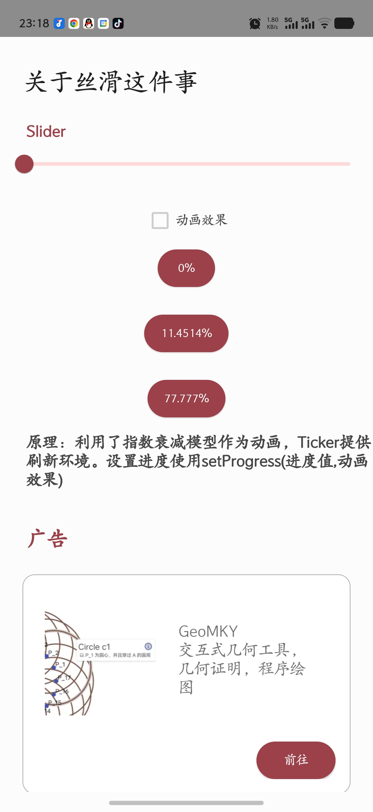 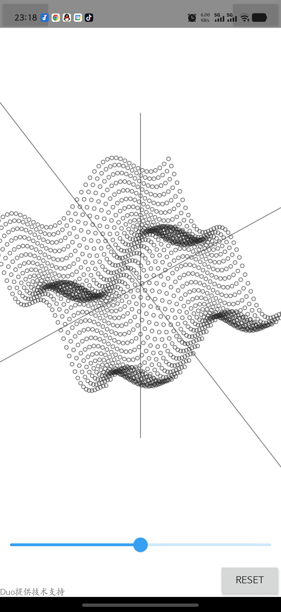 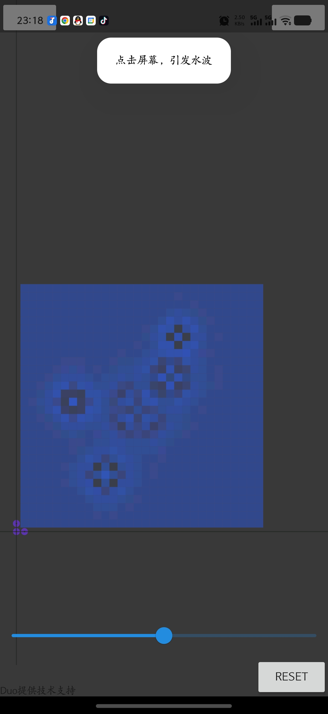 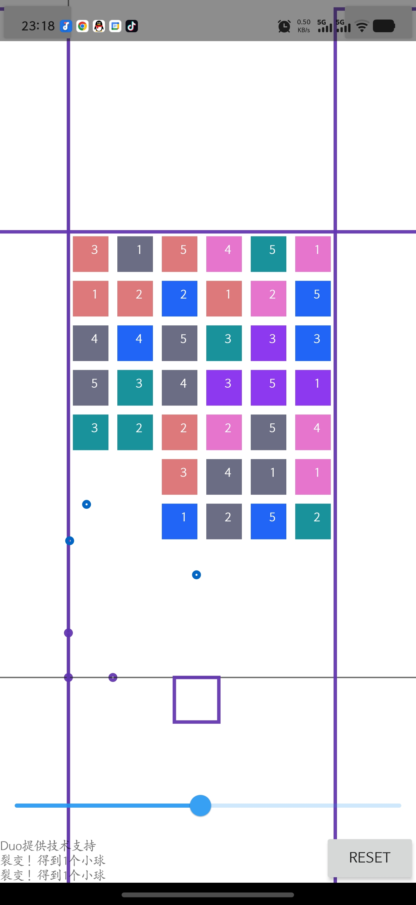 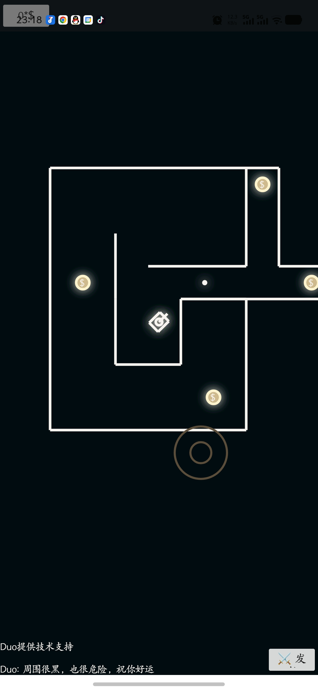

---

 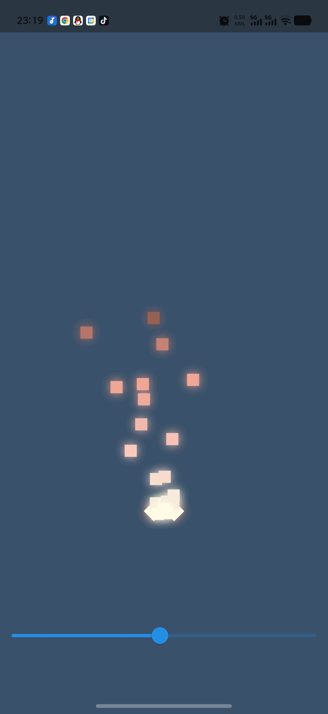 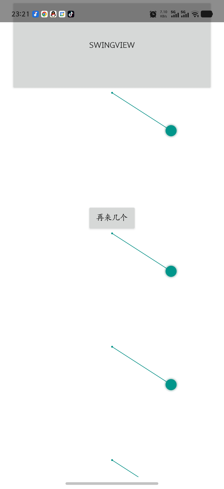 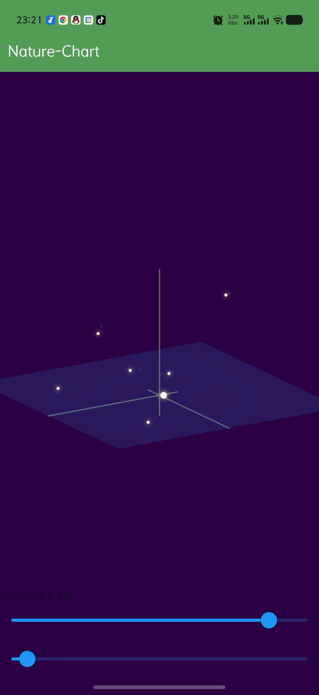 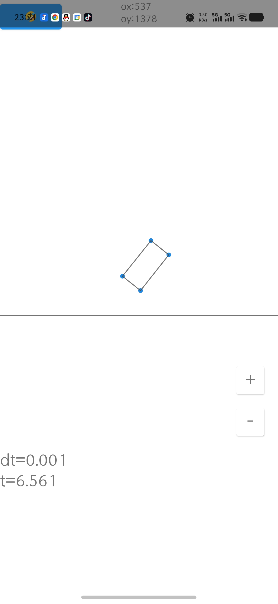

---

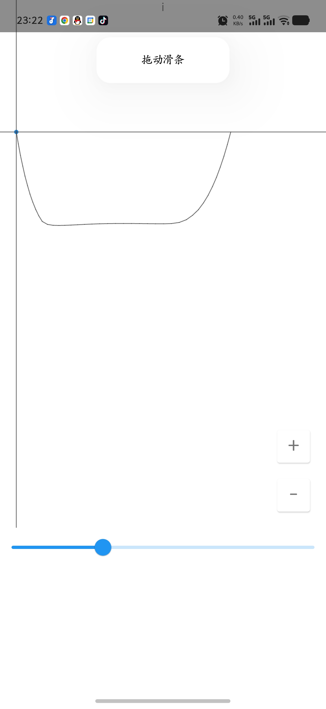 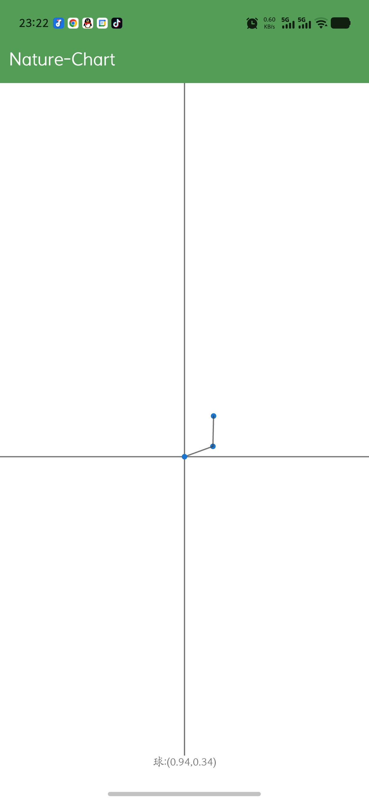 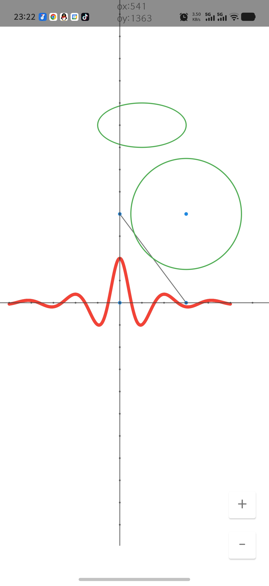 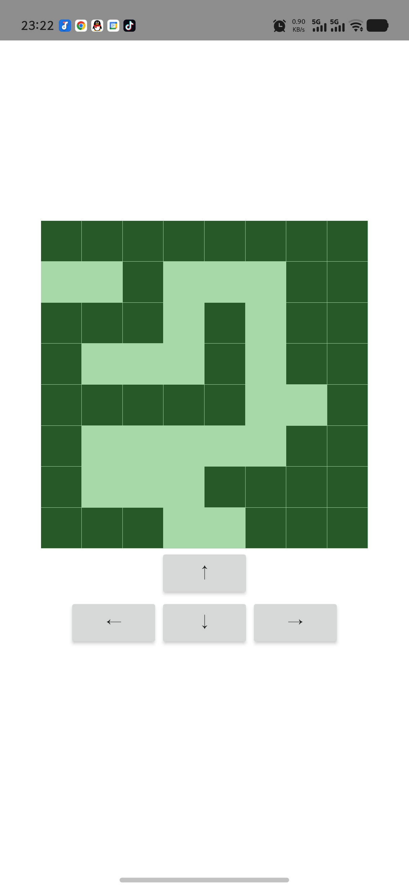 

---

  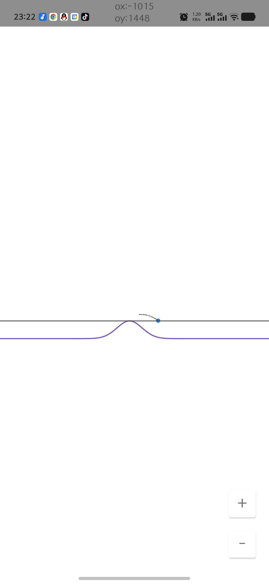

## 项目列表

- [3D 三体](src/3D%20三体.lua)
- [Binary system](src/Binary%20system.lua)
- [CAS](src/CAS.lua)
- [Chart](src/Chart.lua)
- [Clock](src/Clock.lua)
- [Dino](src/Dino.lua)
- [Duolang](src/Duolang.lua)
- [DuoTadpoleSlider-蝌蚪滑动条](src/DuoTadpoleSlider-蝌蚪滑动条.lua)
- [Duo星系](src/Duo星系.lua)
- [Google水平动态加载条](src/Google水平动态加载条.lua)
- [Lua对接GeoGebra](src/Lua对接GeoGebra.lua)
- [MathForest(Nature Math)](<src/MathForest(Nature%20Math).lua>)
- [Mathjax](src/Mathjax.lua)
- [Pi](src/Pi.lua)
- [popCat View](src/popCat%20%20View.lua)
- [ProgressBar](src/ProgressBar.lua)
- [River Music Explore](src/River%20Music%20Explore.lua)
- [SwingView](src/SwingView.lua)
- [Three-Planet System](src/Three-Planet%20System.lua)
- [Tong~](src/Tong~.lua)
- [Translate 翻译](src/Translate%20翻译.lua)
- [\_0](src/_0.lua)
- [☺︎lua num](src/☺︎lua%20num.lua)
- [关于丝滑这件事](src/关于丝滑这件事.lua)
- [函数定积分数值运算](src/函数定积分数值运算.lua)
- [函数零值点运算](src/函数零值点运算.lua)
- [单摆](src/单摆.lua)
- [吞噬黑洞(小游戏)](<src/吞噬黑洞(小游戏).lua>)
- [嗡~](src/嗡~.lua)
- [嗯，波](src/嗯，波.lua)
- [地图限制](src/地图限制.lua)
- [块](src/块.lua)
- [康威生命游戏](src/康威生命游戏.lua)
- [手指拖动 滑动条 的速度&加速度](src/手指拖动%20滑动条%20的速度&加速度.lua)
- [打砖块](src/打砖块.lua)
- [效率不高的『3d建模』--二元函数 3d 绘图器](src/效率不高的『3d建模』--二元函数%203d%20绘图器.lua)
- [数学公式编辑器](src/数学公式编辑器.lua)
- [杆滑](src/杆滑.lua)
- [极坐标绘图](src/极坐标绘图.lua)
- [永恒追及-纳皮尔对数](src/永恒追及-纳皮尔对数.lua)
- [流体模拟初步](src/流体模拟初步.lua)
- [滑雪场](src/滑雪场.lua)
- [火](src/火.lua)
- [物理环境](src/物理环境.lua)
- [绳](src/绳.lua)
- [网页缓冲进度条](src/网页缓冲进度条.lua)
- [节奏闪烁的闪光灯](src/节奏闪烁的闪光灯.lua)
- [蒙特卡洛法计算自然常数e](src/蒙特卡洛法计算自然常数e.lua)
- [计算圆周率近似值](src/计算圆周率近似值.lua)
- [遗传算法训练ai](src/遗传算法训练ai.lua)
- [黑暗迷宫](src/黑暗迷宫.lua)
